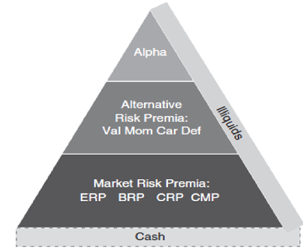
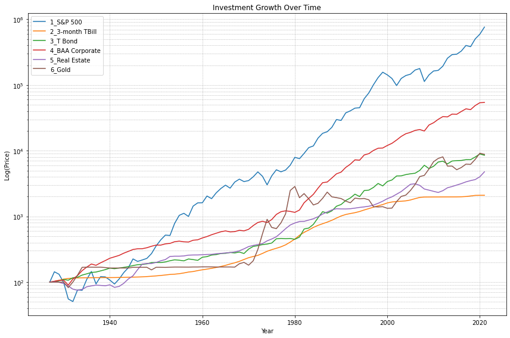

<script src="https://polyfill.io/v3/polyfill.min.js?features=es6"></script>
<script id="MathJax-script" async src="https://cdn.jsdelivr.net/npm/mathjax@3/es5/tex-mml-chtml.js"></script>

## 2강 퀀트투자 이론 <a name = "factor"></a>
### 퀀트 투자자가 주식 시장을 바라보는 가정

퀀트 투자자가 되기 위해서 필요한 주식시장을 바라보는 가정에 대하여 말씀 드립니다. 이것은 '철학'에 가깝습니다. 주식시장에 대한 이런 '철학적 관점'에 동의하지 않는 투자자들에게는 퀀트 투자가 적합하지 않을 수 있습니다. 중도에 포기하기도 쉽습니다. 실제 세상에서 다수의 투자자들이 퀀트를 배워 활용하려고 하다가도 중도에 포기하는 이유는 이런 자세를 견지하지 않기 때문이거나 이런 자세가 있어야 하는지 조차 모르기 때문입니다. 퀀트 투자자가 되기로 결심했다면 다음의 내용에 동의해야 합니다.

1. 시장은 완벽하게 효율적이지는 않다.
2. 완벽한 차익거래 기회는 존재하지 않는다.
3. 비효율성을 활용한 통계적 차익거래 기회는 존재하고 찾을 수 있다.
4. 퀀트기법을 사용하면 정보를 효율적으로 조합할 수 있다.
5. 퀀트기법은 상식과 경제이론에 근거하여 수행되어야 한다.
6. 퀀트기법은 영속적이고 안정적인 패턴을 나타내야 한다.
7. 퀀트기법의 유용성은 불확실성이 충분히 작아야만 검증된다.

이 7가지를 하나씩 설명해 보겠습니다. 

시장 효율성에 대한 이해: 시장은 완벽하게 효율적이지 않습니다. 시장은 거의 효율적이기 때문에 위험을 감수하지 않은 투자자가 수익을 낼 수는 없습니다. 무위험으로 수익을 낼수 있는 기회는 존재하지 않는다는 말입니다. 그러나 시장은 완벽하게 효율적인것은 아닙니다. 그래서 다른 투자자들 보다 상대적으로 적은 위험을 감수하여 수익을 낼 여지는 존재합니다. 우리는 이것을 알파라고 표현합니다.

차익거래의 한계 인식: 완벽한 차익거래 기회는 없습니다. 쉽게 차익을 얻을 수 있는 기회는 제한적입니다. 다만 통계적인 차익거래 기회가 존재합니다.

비효율성을 활용한 기회 인식: 투자자는 시장의 비효율성을 이용하여 통계적인 기회를 찾을 수 있습니다. 이는 시장에서 간과되거나 무시된 정보를 활용하는 것으로, 알파를 찾는 기초입니다. 퀀트분석은 대부분 3번 처럼 통계적 기회를 찾는 과정을 체계화 한 것입니다.

정보 효율적 결합: 퀀트 투자자는 다양한 정보를 효과적으로 결합하여 모델을 구축할 수 있어야 합니다. 이를 통해 예측과 분석을 강화하며, 더 나은 의사결정을 내릴 수 있습니다. 이 부분은 철학에 가깝습니다. 

이론과 모델의 근거: 퀀트 기법은 상식과 경제 이론에 기반해야 합니다. 데이터만으로 결과를 받아들이는 것이 아니라, 이를 이해하고 이론과 상식에 부합하는지 검토해야 합니다. 지나치게 데이터 마이닝을 하면 안된다는 뜻입니다. 데이터 마이닝을 과도하게 해서 만든 전략은 표면적으로 주식 수익률과 관련이 있어 보이는 패턴이 존재하는 것처럼 보일 수 있지만 이는 실전 투자에 활용될 수 없습니다.

안정적인 패턴의 중요성: 퀀트 모델은 일정하고 안정적인 패턴을 나타내야 합니다. 랜덤한 변동이 아닌 지속적이고 의미 있는 특성을 포착하는 모델이 필요합니다.

불확실성을 고려한 유용성 평가: 퀀트 전략의 유용성을 평가할 때는 불확실성을 고려해야 합니다. 모델의 추정 오차가 작을 때에만 실제로 모델의 유용성과 수익률이 검증될 수 있습니다. 추정한 값과 실제 값과의 차이가 작을 때만 모델의 유용성과 높은 수익률이 정당화 된다는 의미입니다. 시장대비 100% 초과달성한 전략과 10% 초과 달성한 전략이 있을 때 기대했던 초과 수익률이 원래 7~8% 수익률 이었다면 후자가 더 훌륭한 모델이라는 의미입니다.

### 시장 효율성
시장은 거의 효율적이지만 완벽하게 효율적이지는 않습니다. 만약 시장이 완벽하게 효율적이라면 퀀트기법 뿐만 아니라 투자를 잘하기 위한 모든 연구는 무의미 해집니다. 그렇기 때문에 연구와 공부를 하는 퀀트 투자자는 자신이 활용할 수 있는 비효율성이 시장에 존재한다고 믿습니다. 효율적 시장 가설하의 주식시장 세계는 주로 학계와 패시브 상품 개발자들이 선호합니다. 물론 학계에서도 시장이 완벽하게 효율적이지는 않다고 보는 경향이 점점 뚜렷해 지고 있으며 효율적 시장 가설과 대치되는 주제의 논문들도 많이 발간되고 있습니다.

|기준|정의|의미|
|--|--|--|
|Weak form| 시장은 과거 주가 패턴 정보를 가격에 반영한다.|기술적 분석은 무의미 하다.|
|Semistrong form| 시장은 공개된 정보를 가격에 반영한다.|기술적 분석, 기본적 분석 모두 무의미 하다.|
|Strong form| 시장은 모든 정보를 가격에 즉각 반영한다.| 내부자 정보도 무의미 하다.|

약형 시장가설, 중형 시장가설, 강형 시장가설이라는 용어를 사용하여 시장을 설명하는 관점을 살펴보겠습니다. 이러한 가설들은 시장의 효율성에 대한 다양한 수준을 나타내는데, 투자 스타일과 관련된 중요한 개념입니다.

1. 약형 시장가설: 이 시장가설을 따르는 시장에서는 기술적 분석, 즉 가격과 거래량을 분석하는 것이 큰 의미가 없다고 여겨집니다. 이는 시장의 가격이 이미 모든 정보를 반영하고 있기 때문입니다. 투자자들은 기술적 분석을 통해 가격의 향방을 예측하는 것이 효과적이지 않다고 믿습니다.

2. 중형 시장가설: 중형 효율적인 시장에서는 모든 공개된 정보가 가격에 반영되어 있습니다. 이는 과거의 가격 정보뿐만 아니라 새로 발표된 정보나 공개 보고서 등 모든 공개 정보가 현재의 주식 가격에 이미 포함되어 있음을 의미합니다. 따라서 기술적 분석과 기본적 분석 모두 유용하지 않다는 것을 의미합니다.

3. 강형 시장가설: 이 가설에서는 심지어 대중이 모르는 내부자 정보조차도 가격에 즉시 반영되기 때문에 어떤 종류의 정보도 투자 결정에 큰 영향을 미치지 않는다고 봅니다. 모든 정보, 공개된 정보뿐만 아니라 비공개된 정보까지도 이미 가격에 반영되어 있습니다. 따라서 어떤 정보도 시장을 능가할 수 없습니다.

이러한 가설들은 실제 시장의 상황을 묘사하는 것보다는 시장의 효율성에 대한 다양한 수준을 표현하는데 사용됩니다. 또한 이러한 가설들에 따라 투자 스타일과 노력의 정도가 달라지며, 투자자의 개인적인 선호나 믿음에 따라 다양한 접근 방식이 채택됩니다.

최근 학계에서는 강형 효율적 시장에 대한 반박 연구도 증가하고 있는데, 이러한 반박은 주로 시장의 이상현상이나 비효율성을 들어 예측하고 설명하려는 내용입니다. 이러한 연구 결과는 시장이 항상 완벽한 효율성을 가지지 않을 수 있음을 보여주며, 실제 시장의 복잡성과 다양성을 이해하는 데 도움이 됩니다.

### 시장이상현상(Market Anomalies)

시장 이상 현상 (Market Anomalies)은 금융 시장에서 예상치 못한 패턴이나 행동을 의미합니다. 이러한 이상 현상들은 투자와 관련된 역사적 데이터를 통해 도출되며, 이들은 효율적 시장 가설에 도전적인 증거로 자주 언급됩니다. 이러한 현상들은 투자자들에게 기회를 제공하기도 하지만, 시장이 항상 효율적이라면 이런 패턴을 통해 추가 수익을 창출하는 것은 불가능해야 합니다. 따라서 이러한 현상들은 시장 효율성의 한계를 보여줄 수 있습니다. 팩터 모델도 이러한 시장 이상 현상의 발견을 기반으로 만들어진 개념입니다. 아래에서는 몇 가지 유명한 시장 이상 현상을 살펴보겠습니다.

1. Value Effect: 저가주로 평가된 기업들(PER, PBR, PCR, PSR이 낮은)의 수익률이 좋은 현상.
2. Size Effect: 소형주가 대형주보다 수익률이 좋았던 현상.
3. January Effect: 1월에 소형주나 작년에 수익률이 좋지 않았던 주식들의 수익률이 좋은 현상.
4. Calendar Effect: 계절적 요인으로 인한 현상으로, 요일이나 휴일, 11월에서 4월까지의 수익률이 좋은 할로윈 현상 등을 포함합니다.
5. Neglected-Firm Effect: 애널리스트의 커버를 받지 않는 기업의 수익률이 좋은 현상.
6. IPO Effect: 새로 상장한 기업이 상장 후 3~5년간 성과가 안 좋은 현상.
7. Index-Change Effect: 인덱스에 신규 편입된 종목들의 성과가 좋은 현상.
8. Momentum: 과거 수익률이 좋았던 기업의 향후 수익률이 좋은 현상.
9. Analyst Recommendation Effect: 투자 의견이 상향 조정된 기업들의 수익률이 좋은 현상.
10. Insider Trading Effect: 내부자가 주식을 매수한 기업의 수익률이 좋은 현상.
11. Stock Buyback Effect: 자사주를 매입한 기업의 수익률이 좋은 현상.
12. Spin-Offs Effect: 사업 분할 시 기업의 수익률이 좋은 현상.

이상 현상들은 경제학자와 금융 전문가들이 연구하고 해석하는 대상이며, 이를 기반으로 투자 전략을 구성하거나 투자 의사결정을 내릴 때 고려할 수 있습니다. 그러나 이러한 현상도 시장의 변동성과 불확실성을 고려해 신중하게 분석해야 하며, 모든 상황에서 예측 가능한 패턴은 아닙니다.

여기에 언급된 12가지 현상 중 일부는 과거에는 효과가 있었지만 최근 몇 년간 작동하지 않는 경우도 있습니다. 그럼에도 불구하고 몇 가지 현상은 여전히 유용합니다. 이러한 현상들은 시장의 비효율성을 보여줍니다. 투자자들의 심리와 행동은 예측할 수 없는 비합리적인 요소들을 내포하므로, 이러한 이상 현상들은 계속해서 나타날 수 있습니다.

시장의 효율성은 시간과 상황에 따라 변화합니다. 국가나 산업별 주식시장의 특성에 따라 효율성이 변할 수 있습니다. 예를 들어, 미국의 어떤 산업이 효율적일 수 있는 반면, 한국에서는 비효율적일 수 있습니다.

정리하자면, 시장은 완벽하게 효율적이지 않지만 부분적으로는 효율적입니다. 이는 시장의 비효율성을 야기하는 다음과 같은 이유가 있기 때문입니다.

1. 정보 취득 비용: 정보를 얻는 것 자체에 비용이 들며, 이로 인해 모든 투자자가 모든 정보를 쉽게 얻을 수 없습니다.
2. 정보 전달 지연: 공개된 정보라도 정보가 전달되는 데는 시간이 걸리며, 이로 인해 시장 반응에 지연이 발생할 수 있습니다.
3. 정보 처리 능력: 모든 투자자가 수많은 정보를 효율적으로 처리할 능력을 갖지 못할 수 있습니다.
4. 정보 조합: 공개된 정보를 필터링하고 조합하여 새로운 정보로 가공하는 능력이 다른 사람들보다 뛰어난 투자자가 존재합니다. 그는 정보에 대한 특별한 통찰을 얻을 수 있습니다.
5. 감정에 의한 결정: 많은 투자자들이 이론적이 아닌 감정에 의해 정보를 해석하고 투자하는데, 이로 인해 비합리적인 행동이 나타날 수 있습니다.
6. 투자자들의 비합리적 행동을 이용하려고 투자 전략을 세우는 행위 자체가 시장에 추가적인 비효율성을 도래시킬 수 있습니다.
7. 기술 및 경제적 변화: 기술의 발달과 경제적 상황은 항상 변화하며, 이에 대한 투자자들의 적응은 시간이 걸릴 수 있습니다.
8. 거래 비용: 실제 거래 비용은 이론적 모델과 실제 투자 성과 간의 불일치를 유발할 수 있습니다.
9. 세금의 영향: 세금은 시장을 왜곡시키고 투자자들의 결정에 영향을 미칠 수 있습니다.
10. 정부 정책 변화: 정부의 정책 변화는 이론적 모델과 실제 시장의 불일치를 유발할 수 있습니다.

주식시장에서 정보가 가격에 바로 반영되는 것은 그 시장이 효율적일 때의 특징입니다. 하지만 모든 투자자가 같은 정보에 동일하게 접근하는 것은 아닙니다. 이 차이는 주로 정보 접근에 드는 비용 때문입니다. 예를 들어, 대형 투자 기관들은 방대한 금융 데이터베이스에 접근할 수 있는 반면, 개인 투자자들은 좋은 품질의 데이터를 찾는 데 어려움을 겪습니다. 이로 인해 전문 투자자들은 재무 데이터나 애널리스트의 리포트, 다양한 대안 데이터 등을 활용해 투자 결정을 내릴 수 있습니다. 반면 일반 투자자들은 주로 가격과 거래량과 같은 기본 정보를 기반으로 투자 의사결정을 합니다. 정보의 양과 질이 다르므로, 정보는 어떤 사람들에게는 느리게, 불균일하게 전달될 수 있습니다. 이 때문에 정보가 가격에 즉각적으로 반영되지 못하는 경우도 있습니다.

일부 전문가 투자자들, 특히 퀀트 전략을 사용하는 투자자들은 대량의 데이터에 접근할 뿐만 아니라 그 데이터를 효과적으로 처리하는 능력도 갖추고 있습니다. 이러한 퀀트 투자자들은 데이터 분석 능력으로 인해 일반 투자자들보다 정보를 더 빨리, 정확하게 해석하는 데 유리한 위치에 있습니다.

투자자들의 감정은 가격의 비효율성을 초래하기도 합니다. 많은 사람들이 투자 결정을 할 때 감정에 휘둘리기 쉽습니다. 이로 인해 실제 가치와 다른 가격이 형성될 수 있습니다. 반면, 퀀트 투자자들은 수학적 모델을 사용하여 감정을 제외하고 투자 결정을 내리려고 합니다. 이 모델은 매니저가 통계적 차익거래 기회에서 비합리적인 가격 움직임을 발견하는 데 도움을 줍니다.

경제와 시장은 계속 변하며, 그 변화를 이해하려면 시간이 필요합니다. 변화가 얼마나 영향을 미칠지 정확한 가치 평가가 불가능 하다는 말입니다. 추정을 할 수 있을 뿐입니다. 가령 1990년대말에는 인터넷 모델에 대한 과도한 기대감으로 인해 기술주 버블이 형성되었습니다. 그 결과는 이후에 잘 알려진 대로 많은 기업들의 주가가 크게 떨어졌습니다. 2020년의 언택트와 코로나 관련 주식들의 버블도 마찬가지 입니다.

또한, 주식을 사거나 팔 때 발생하는 거래 비용은 시장의 효율성을 해칠 수 있습니다. 이런 거래 비용으로 인해 이론적으로 적정하다고 생각되는 가격과 실제 거래 가격 사이에 차이가 발생할 수 있습니다. 특히 거래 비용이 높은 신흥국 주식시장 같은 경우에는 이 차이가 더욱 두드러집니다.

정부의 규제도 시장의 비효율성을 초래할 수 있습니다. 일부 국가에서는 고정환율 제도나 금리 조정, 주식 거래에 관한 규제 등 다양한 규제로 인해 시장 가격이 크게 변동하기도 합니다.

지금까지 언급한 이런 이유로 시장의 완전한 효율성에는 한계가 있습니다. 이로 인한 비효율성은 퀀트 투자자들에게 수익 창출의 기회로 볼 수 있습니다. 그렇다면 왜 이런 기회를 적극적으로 활용하여 더 많은 수익을 얻지 못할까요? 대다수의 퀀트 투자자들이 지속적인 수익을 달성하지 못하는 주요 이유를 제시하면 다음과 같습니다.

첫째, 모든 비효율성이 순수한 차익거래 기회로 나타나지 않습니다. 대부분은 위험은 낮으나 완전히 리스크가 없는 것은 아닌 통계적 차익거래 기회로 나타납니다. 이러한 성질로 인해 필연적으로 수익을 얻지 못하는 기간이 생깁니다.

둘째, 충분한 수익을 창출할 만큼의 차익거래 기회는 그렇게 많지 않습니다. 이는 기회가 제한적이라는 것을 의미하며, 그 결과로 장기적으로 수익을 얻기 어려운 시기가 필연적으로 생깁니다.

셋째, 퀀트 투자자들 역시 이런 어려운 시기를 겪을 때 심리적인 영향을 받을 수 있습니다. 

하지만 퀀트 투자자는 과거의 데이터를 근거로 위기 상황을 수치적으로 분석하고, 이를 통해 자신의 포트폴리오를 개선하는 작업을 통해 이는 과거의 경험과 데이터를 바탕으로 모델을 지속적으로 정교화 해간다는 장점이 있습니다. 즉 퀀트 투자의 강점은 경험과 연구를 통해 계속해서 기존의 모델을 발전시키는 데 있습니다. 정성적 분석에 대한 연구는 공식화가 힘들고 때문에 휘발되는 지식의 비율이 높은 반면 퀀트 기반의 연구는 경험이 모델의 정교함으로 이어지는 비율이 높습니다.


### 퀀트 이론

#### 수익률 분해 이론

*수익률 = Rf + 시장 리스크 프리미엄 + 대체 리스크(팩터) 프리미엄 + Alpha + (비유동성)*


*리스크 프리미엄에 대한 분해

#### 시장 리스크 프리미엄
각 자산군의 역사적 수익률에 대한 연구는 다음과 같은 사이트에 있습니다.

https://pages.stern.nyu.edu/~adamodar/New_Home_Page/datafile/histretSP.html

이를 직접 확인하는 파이썬 코드를 작성해 보겠습니다.

```python
import requests
from bs4 import BeautifulSoup
import pandas as pd
import matplotlib.pyplot as plt
import numpy as np

# Step 1: Load the webpage
import requests
from bs4 import BeautifulSoup
import pandas as pd
import matplotlib.pyplot as plt
import numpy as np

# Step 1: Load the webpage
url = 'https://pages.stern.nyu.edu/~adamodar/New_Home_Page/datafile/histretSP.html'
response = requests.get(url, verify=False)
soup = BeautifulSoup(response.content, 'html.parser')

# Step 2: Extract the table
table = soup.find_all('table')[0]
df = pd.read_html(str(table))[0]

# Step 3: Tidy the data
data = df.iloc[2:-1, [0, 7, 8, 9, 10, 11, 12]].copy()
data.columns = ['Year', '1_S&P 500', '2_3-month TBill', '3_T Bond', '4_BAA Corporate', '5_Real Estate', '6_Gold']
data.replace('', np.nan, inplace=True)
data = data.replace('[^0-9.-]', '', regex=True)
data = data.astype(float)
data = pd.concat([pd.DataFrame({'Year': [1927], '1_S&P 500': [100], '2_3-month TBill': [100], '3_T Bond': [100], '4_BAA Corporate': [100], '5_Real Estate': [100], '6_Gold': [100]}), data], ignore_index=True)

# Step 4: Plot the data
plt.figure(figsize=(12, 8))
for col in data.columns[1:]:
    plt.plot(data['Year'], data[col], label=col)
    
plt.yscale('log')
plt.xlabel('Year')
plt.ylabel('Log(Price)')
plt.title('Investment Growth Over Time')
plt.legend(loc='upper left')
plt.grid(True, which='both', linestyle='--', linewidth=0.5)
plt.tight_layout()
plt.show()
```




```python
# Compute the year-over-year change
data_pct_change = data.set_index('Year').pct_change().reset_index()

# Melt the dataframe
melted_data = data_pct_change.melt(id_vars='Year', var_name='name', value_name='value').dropna()

# Group by the 'name' column and compute mean and standard deviation
summary = melted_data.groupby('name').agg(mu=('value', 'mean'), sd=('value', 'std')).reset_index()

# Plotting
plt.figure(figsize=(10, 6))
sns.scatterplot(data=summary, x='sd', y='mu', hue='name', size=5, legend=False)
for i, row in summary.iterrows():
    plt.text(row['sd'], row['mu'], row['name'], fontsize=10, ha='right')

plt.xlabel('Risk')
plt.ylabel('Return')
plt.title('Risk vs Return')
plt.grid(True, which='both', linestyle='--', linewidth=0.5)
plt.gca().set_facecolor('white')

# Format the axis to be in percentage
from matplotlib.ticker import FuncFormatter
formatter = FuncFormatter(lambda y, _: '{:.0%}'.format(y))
plt.gca().xaxis.set_major_formatter(formatter)
plt.gca().yaxis.set_major_formatter(formatter)

plt.tight_layout()
plt.show()
```


결과를 해석해 보면 수익률은 [주식> 미국 회사채> 중기채> 부동산> 미국 단기채] 순서입니다. 위험이 높을수록 수익률이 높다는 결과를 실증적으로 확인해 볼 수 있습니다. 금은 미국 주식에 비해 위험은 높고 수익률은 낮은 열위의 자산임을 추가로 확인할 수 있었습니다.

#### 주식 위험 프리미엄

주식만 따로 빼서 주식의 위험 프리미엄은 어느정도일지 구체적인 숫자를 확인해 보겠습니다. 앞에서 살펴본 것은 과거 수익률입니다. 단순하게는 S&P500의 과거 연환산 수익률에서 미국 단기 국고채의 연환산 수익률을 빼면 주식의 위험프리미엄이 계산됩니다. 위험 프리미엄을 측정하는 법은 이것 말고도 존재합니다.

1. 과거 수익률
2. 수익률 분해 공식 활용
3. 현재 이율을 기반으로 한 공식 활용

먼저 과거 수익률로 구체적인 숫자를 제시해 보겠습니다. 주식 프리미엄은 국가별로 상이합니다. 


*Average Compound Returns and Premia for Global Equities, 1900–2020
Source: Data from Dimson-Marsh- Staunton (2021). Copyright © Elroy Dimson, Paul Marsh, and Mike Staunton*

그 다음은 수익률 분해 공식을 활용해 보겠습니다.

$$
R_{t+1} = \frac{P_{t+1} - P_t + D_{t+1}}{P_t}
$$
$$
= \underbrace{\frac{D_{t+1}}{P_t}}_{\text{배당 수익률}} + \underbrace{\frac{P_{t+1} - P_t}{P_t}}_{\text{시세 차익}}
$$

이 수식을 좀 더 분해해 보겠습니다. 

우선 $PD_t$ 는 $P_t\over{D_t}$를 다른 방식으로 표현한 것이고 이는 가격을 배당으로 나눈, 주식 가격과 배당금의 비율입니다. 이를 활용해 위의 공식을 한번 더 분해해 보겠습니다.

$$
R_{t+1} = \frac{D_{t+1}}{P_t} + \frac{D_{t+1}-D_t}{D_t}+\frac{PD_{t+1}-PD_t}{PD_t}+\frac{D_{t+1}-D_t}{D_t}\cdot \frac{PD_{t+1}-PD_t}{PD_t}
$$

$D_{t+1}\over{P_t}$ : 배당수익률을 나타냅니다.

$\frac{D_{t+1}-D_t}{D_t}$: 이 항목은 배당금의 성장률을 나타냅니다.

$\frac{PD_{t+1}-PD_t}{PD_t}$ : PD는 주식가격과 배당금의 비율입니다. 이 항목은 주식의 가격이 배당금에 비해 얼마나 변동했는지를 나타냅니다.

$\frac{D_{t+1}-D_t}{D_t}\cdot \frac{PD_{t+1}-PD_t}{PD_t}$ : 이 항목은 배당성장률과 배당대비 주식 가격 변동률간의 상호작용을 나타냅니다. 단일 요소로 설명되지 않는 미세 조정이라고 보면 됩니다.

위 공식을 정리해보면 주식 투자에서는 크게 세 가지 방법을 통해 수익을 얻을 수 있습니다. (미세조정은 제외)

배당 수익: 기업이 이익을 나눠주는 것으로, 주주에게 배당금을 지급합니다. 배당금이 많을수록 투자 수익률도 높아집니다. 주의할 점은 주식의 가격과 연관된 배당을 고려해야 하며, 이를 배당 수익률이라고 합니다. 단순히 주가가 낮아 배당 수익률이 높을 수도 있습니다. 일반적인 배당 수익률은 2% 정도이지만, 기업들은 배당을 지불하는 정책을 때로는 변화시킵니다.

배당 성장: 시간이 지남에 따라 주식의 배당금이 늘어날 경우 수익률도 증가합니다. 이는 미래의 배당 소득을 향상시키지만, 수익률은 더욱 즉각적으로 증가할 수 있습니다. 예를 들어, 주가 배당률이 변하지 않는 상태에서 배당금이 4% 증가하면 주가도 4% 상승합니다. 기업의 이익과 배당금은 인플레이션 영향을 받기 때문에, 2%의 인플레이션은 수익과 배당금을 2% 증가시킬 수 있습니다. 또한 기업이 정상 경제 성장 상황에 있다면 실질 배당금이 약 2% 정도 증가할 수 있습니다.

밸류에이션 변화: 주식의 가치 변동으로 양(수익) 또는 음(손실)의 수익을 얻을 수 있습니다. 예를 들어, 주가 배당률이 시간에 따라 변하면 주식 가치도 변합니다. 이는 밸류에이션의 변화에 따른 가격 변동을 의미합니다. 밸류에이션 변화로 인해 주식 가치가 상승하거나 하락할 수 있습니다.

과거의 데이터를 살펴보면, 미국에서는 현금 대비 주식의 프리미엄이 연간 약 7~8%였습니다. 역사적 배당 수익률은 평균 3.9%이며, 인플레이션 영향을 고려한 배당 성장률은 약 4.6%입니다. 주가 배당률의 상승에 따른 밸류에이션 변화로 인한 가격 변동은 약 2.4%입니다. 이에 조정된 무위험 이자율은 3.5%입니다. 이러한 수치들은 과거 주식 수익률인 11%와 그 중에서 위험에 대한 프리미엄인 7.5%를 설명하는 데 활용됩니다.

마지막으로 주식의 수익률은 현재의 이익수익률(Earning yield) 기반으로 설명할 수 있습니다. 

$$
R_{t+1} = \frac{NI_{t+1}}{P_t} + \frac{P_{t+1} -(P_t+NI_{t+1}-D_{t+1})}{P_t}
$$

이 공식은 주식의 전체 수익률을 두 가지 주요 구성 요소로 분해하는 것을 보여줍니다. 각 구성 요소를 간략하게 설명하겠습니다:

이율 : 이 부분은 주식의 순이익률을 나타냅니다. 여기서 $NI_{t+1}$은 주당 순이익을, $P_t$는 주식 가격을 나타냅니다.

가격 잉여 : 가격 잉여는 실제로 주식의 가격이 예상된 가격 변동보다 얼마나 많이 변동했는지를 나타내는 지표입니다. 예상된 가격 변동은 주로 회사의 순이익과 배당금에 의해 결정됩니다.$P_{t+1}$은 변화된 주식가격, $P_t$는 매수 시점의 주식가격을 의미합니다. $P_t + NI_{t+1} - D_{t+1}$ 는 주주들이 다음시점 t+1에 기대하는 가격을 의미합니다. 

풀어서 설명하면 내가 $P_t$라는 돈을 주고 구매한 주식의 가격은 다음 기간에 회사가 벌어들인 이익($N_{t+1}$)만큼의 값어치를 증가시킬 것이라 기대합니다. 그런데 실제로는 다양한 요인들로 인해 주식의 가격은 이 기대치보다 더 많이 증가하거나 감소할 수 있다. 이렇게 예상보다 더 많이 증가하거나 감소한 부분을 가격 잉여라고 부릅니다.

가격 잉여 부분은 성숙한 기업이 도면 인플레이션율과 거의 일치하게 된다고 가정합니다. 이는 물가가 상승하면 기업의 명목 수익도 물가 상승률 만큼 증가할 것이라는 기대 때문입니다.

그러므로 주식의 기대수익률은 다음과 같습니다.
$$
E_t(R_{t+1}) = \frac{E_t(NI_{t+1})}{P_t} + i
$$

이 방식을 사용하여 계산해보면 미국에서 가격 잉여는 약3.6%로 나오는데 이는 역사적인 물가 상승률인 3%와 비교해보면 0.6% 정도밖에 차이가 나지 않습니다. 기업의 이익과 인플레이션 데이터를 사용해서 계산해보면 주식의 명목 수익률은 11%정도입니다. 이는 실제 과거 주식 수익률(S&P500 기준)과 매우 유사합니다.

경기가 조정된 이율(earning yield)는 쉴러의 경기조정주가수익비율(cyclically adjusted price earnings, CAPE)의 역수를 통해 계산할 수 있습니다. 여기에 물가 상승률을 더하면 기대 명목 주식수익률을 구할 수 있습니다. CAPE는 10년간의 이익을 기반으로 경기를 조정하여 PER을 계산한 값입니다. 다음의 출처에서 데이터를 구할 수 있습니다.

https://www.multpl.com/s-p-500-earnings-yield

CAPE 값이 높으면 기대되는 이익수익률이 작은 것입니다.

다음은 국가별로 CAPE를 구하는 코드입니다.
```python
import pandas as pd
import matplotlib.pyplot as plt
import seaborn as sns


url = 'https://indices.barclays/file.app?action=shared&path=shiller/cape.csv'
cape = pd.read_csv(url)
cape['Date'] = pd.to_datetime(cape['Date'], format='%d/%m/%Y')

last_row = cape.tail(1).melt(id_vars=['Date'])

plt.figure(figsize=(10, 6))
sns.barplot(data=last_row, y='variable', x='value', palette='viridis')
for index, value in enumerate(last_row['value']):
    plt.text(value, index, str(round(value, 2)), color='white', va='center')
plt.title('전 세계 국가별 CAPE 지수')
plt.xlabel('')
plt.ylabel('')
plt.show()
```


실제 이런 지표들이 미래 성과를 예측하는데 유용했을지를 확인해 보겠습니다.
CAPE값이 높을때(낮을때) 향후 S&P500의 수익률이 낮았으면(높았으면) 증명되는 것입니다.

U.S. Equity 10-year returns sorted by starting CAPE Valuation, 1900–2015.


**MARKET TIMING: SIN A LITTLE RESOLVING THE VALUATION TIMING PUZZLE, Cliff Asness (2017)

*CAPE가 높았던 시기에 향후 10년간 수익률은 낮았으며, CAPE가 낮았던 시기의 향후 10년간 수익률이 높았습니다. 물론 1년내 수익률을 설명하는 유의성은 낮습니다.


#### 주식팩터모델 (CAPM, FF3, APT..)

주식팩터모델은 특정한 팩터에 초점을 맞추어 주식의 수익률 변동성을 설명하려는 목적으로 사용됩니다. 주식팩터모델은 주식 수익률의 시스템적 요인을 파악하는 데 사용됩니다. 앞에서 배운 프리미엄 계산 방식은 자산의 수익률을 여러 요소로 분해하여 보다 포괄적으로 설명하려고 합니다 즉, 두 접근법 모두 자산의 수익률을 설명하는 방법이지만 포함하는 요소와 접근 방식, 그리고 사용목적이 다릅니다.

어떤 팩터가 확실히 의미가 있으려면 주식의 수익률에 대한 설명력이 있어야 합니다. 즉 팩터값이 높은 주식 그룹의 수익률을 좋고 낮은 주식 그룹의 수익률이 좋지 않으면 됩니다. 또한 그 성과가 장기적으로 우수하면 됩니다.

최초의 팩터 모델 (CAPM, Capital Asset Pricing Model)

최초의 팩터 모델인 CAPM에서는 주식의 수익률이 시장수익률과 주식의 고유요인 두가지로 구성되어 있다고 합니다. 시장 수익률을 체계적 위험, 주식의 고유 요인을  비체계적 위험이라고 표현합니다.


|구분|내용|
|---|---|
|체계적 위험|모든 위험자산에 영향을 미치는 분산 불가능 위험.|
|비체계적 위험|개별 기업이 직면하는 위험으로 분산투자를 통해 제거 가능|

체계적 위험은 전체 시장이나 경제에 영향을 받는 위험입니다. 예를 들어, 금리 변동, 경제 침체, 지정학적 이벤트 등이 여기에 해당합니다. 체계적 위험은 분산 투자로 제거할 수 없으므로, 투자자는 체계적 위험을 부담하기 위해 추가적인 수익률을 기대합니다. 이를 시장 리스크 프리미엄이라고 합니다.

비체계적 위험은  특정 회사나 산업에만 영향을 미치는 위험입니다. 예를 들어, 한 회사의 경영진 스캔들, 특정 제품의 리콜 등이 여기에 해당합니다. 이러한 위험은 여러 종목으로 분산 투자함으로써 제거하거나 최소화할 수 있습니다.
비체계적 위험은 계산이 불가능하고 투자자가 분산투자를 통해 제거가 가능하므로 이에 대한 추가적인 수익률을 기대할 수 없으므로 0으로 하는 것입니다.

개별 주식의 기대 수익률에서 제거 가능한 비체계적 위험에 대한 항목을 제거하고 나면, 체계적 위험에 대해서만 보상을 해주면 됩니다.
체계적 위험에 대한 노출도($\beta $) 는 다음과 같이 계산할 수 있습니다.

$$E(R_i) - R_f = \beta_i \times [E(R_m)-R_f]$$

개별 주식의 기대 수익률은 주식 시장의 변화에 얼마나 민감한가(베타의 크기)에 대해서만 보상된는 것이 CAPM 모델입니다.

회귀분석을 사용합니다.

![]

주식 수익률 모델로 보면 y가 주식수익률 x가 시장수익률 입니다. 오차항은 비체계적 위험이고 시장수익률에 대한 반응, 즉 체계적 위험에 대한 노출도를 베타($\beta$) 라고 합니다.

베타의 개념을 조금 풀어서 설명해 보겠습니다.

베타는 주식이 시장의 움직임에 얼마나 민감하게 반응하는지를 나타냅니다. 예를 들어, 시장 수익률이 1% 상승할 때 주식 수익률이 2% 상승한다면, 그 주식의 베타는 2입니다. 반대로, 주식 수익률이 0.5%만 상승한다면 베타는 0.5가 됩니다. 즉, CAPM 모델에서는 주식의 시장 수익률에 대한 반응도를 '베타'로 설명합니다.

현실세계의 예를 하나 들어보면 학생의 성적을 모델링 하는 것과 비교해 볼 수 있습니다.각 학생은 공부 시간에 따라 다른 성과를 보입니다. 어떤 학생은 짧은 시간에도 뛰어난 성적을 얻을 수 있고, 다른 학생은 더 많은 시간을 투자해야 합니다. 이를 '공부 효율'이라고 생각할 수 있으며 이를 성적에 대한 베타로 볼 수 있습니다.

다음은 애플의 베타를 구해보는 코드입니다.
과거 S&P500 수익률과 애플주식의 수익률을 사용해서 구합니다.

```python
import pandas as pd
import yfinance as yf
import numpy as np
import requests
from io import BytesIO
from zipfile import ZipFile

import matplotlib.pyplot as plt
import seaborn as sns

# AAPL 주식 데이터 다운로드
aapl = yf.download('AAPL', start='1980-01-01', progress=False)
Ri = aapl['Adj Close'].pct_change().dropna()
Ri_monthly_cumulative = Ri.resample('M').apply(lambda x: (1 + x).prod() - 1)

# Fama/French 3 Factors 데이터 다운로드
url = 'http://mba.tuck.dartmouth.edu/pages/faculty/ken.french/ftp/F-F_Research_Data_Factors_CSV.zip'
with requests.get(url) as r:
    with ZipFile(BytesIO(r.content)) as z:
        with z.open('F-F_Research_Data_Factors.CSV') as f:
            factors = pd.read_csv(f, skiprows=3, nrows=1151, index_col=0)
factors.index = pd.to_datetime(factors.index, format='%Y%m')
factors = factors[['Mkt-RF', 'RF', 'SMB']]
factors = factors / 100  # 데이터를 퍼센트에서 소수로 변환


# 월초 날짜를 월말 날짜로 변경
factors.index = factors.index + pd.offsets.MonthEnd(0)

# 월말 날짜로 데이터 병합
data_bind = pd.merge(Ri_monthly_cumulative, factors, left_index=True, right_index=True, how='inner')


# 'Ri-RF' 컬럼 추가
data_bind['Ri-RF'] = data_bind['Adj Close'] - data_bind['RF']

# 그래프 그리기
plt.figure(figsize=(8, 6))
sns.scatterplot(data=data_bind, x='Mkt-RF', y='Ri-RF')
sns.regplot(data=data_bind, x='Mkt-RF', y='Ri-RF', scatter=False, color='blue', line_kws={"linewidth": 1})
plt.axline((0, 0), slope=1, color='red', linewidth=1)
plt.xlim(-0.2, 0.2)
plt.ylim(-0.2, 0.2)
plt.show()
```


붉은선이 베타가1인 선이고 파란색이 애플의 수익률을 회귀분석한 결과입니다.
기울기가 좀 더 가파르기 때문에 베타가 더 크다고 볼 수 있습니다.

다음 코드를 사용하면 통계분석 결과를 볼 수 있습니다.
```python
import statsmodels.api as sm

# 'Ri-RF' 컬럼 추가
data_bind['Ri-RF'] = data_bind['Adj Close'] - data_bind['RF']

# 회귀모델 설정
X = data_bind['Mkt-RF']
X = sm.add_constant(X)  # 상수항 추가
y = data_bind['Ri-RF']
model = sm.OLS(y, X).fit()

# 결과 출력
print(model.summary())
```

```
                            OLS Regression Results                            
==============================================================================
Dep. Variable:                  Ri-RF   R-squared:                       0.226
Model:                            OLS   Adj. R-squared:                  0.224
Method:                 Least Squares   F-statistic:                     144.8
Date:                Fri, 11 Aug 2023   Prob (F-statistic):           1.91e-29
Time:                        15:52:21   Log-Likelihood:                 375.81
No. Observations:                 498   AIC:                            -747.6
Df Residuals:                     496   BIC:                            -739.2
Df Model:                           1                                         
Covariance Type:            nonrobust                                         
==============================================================================
                 coef    std err          t      P>|t|      [0.025      0.975]
------------------------------------------------------------------------------
const          0.0109      0.005      2.113      0.035       0.001       0.021
Mkt-RF         1.3784      0.115     12.035      0.000       1.153       1.603
==============================================================================
Omnibus:                       18.332   Durbin-Watson:                   1.968
Prob(Omnibus):                  0.000   Jarque-Bera (JB):               41.681
Skew:                          -0.096   Prob(JB):                     8.89e-10
Kurtosis:                       4.404   Cond. No.                         22.4
==============================================================================
```

베타는 1.37 정도로 1보타 높으며 p값이 거의 0에 수렴할 정도로 유의성이 매우 높습니다. 이 모델이 애플의 수익률을 설명하는 R스퀘어값은 22.6%정도입니다. 높은지 낮은지에 대한 기준은 없습니다.

관련 논문 링크 (1964년) :
https://onlinelibrary.wiley.com/doi/10.1111/j.1540-6261.1964.tb02865.x

CAPM과 관련한 정리하자면 
1. 주식의 기대수익률은 시장수익률과의 선형함수이다.
2. 시장 베타가 기대수익률의 횡단면을 설명하는데 충분하다.

이 두가지를 주장하고 있습니다. 
다만 앞으로 후술할 다른 연구들을 통해 이는 반박됩니다.

## 마치며
다음 강의에는 팩터 투자와 관련한 과거 연구사례들을 살펴봅니다.

<script type="text/javascript" src="http://cdn.mathjax.org/mathjax/latest/MathJax.js?config=TeX-AMS-MML_HTMLorMML"></script>
<script type="text/x-mathjax-config">
  MathJax.Hub.Config({
    tex2jax: {inlineMath: [['$', '$']]},
    messageStyle: "none",
    "HTML-CSS": { availableFonts: "TeX", preferredFont: "TeX" },
  });
</script>